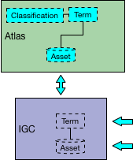
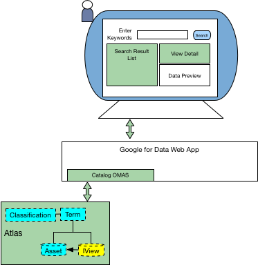

<!-- SPDX-License-Identifier: CC-BY-4.0 -->
<!-- Copyright Contributors to the ODPi Egeria project 2020. -->

# Virtual Data Connector (VDC) Demo

The virtual data connector demo shows metadata exchange between two open metadata
repositories and the use of this metadata to configure a data virtualization platform with
views and a security tool to provide metadata-driven access control for the data
virtualization platform.

It supports two basic use cases:

- An end user wishes to find some interesting data by searching the open metadata
    repositories.
- When they have found the data source they want, they wish to preview a subset of its data
    values to verify that it really is the data they need.

These use cases seem simple but they raise three very important questions that create
an explosion of requirements in Egeria.

1. What metadata is required to describe the data sources such that the end user can
    accurately locate the data sources they need - assuming they are not familiar with the
    content and organization of the data sources?

    Typically the end user would want to use meaningful business terms to describe
    the data they need. They may also want to see:

    - related descriptions of the data
    - the profile of its data values
    - the data's lineage
    - information about the owners/stewards of the data, and the organization they come from
    - any license associated with the data

    To provide this information, the VDC project needs to build out the
    **[default types for open metadata](https://egeria.odpi.org/open-metadata-publication/website/open-metadata-types)**
    and **[provide a new catalog API](https://egeria.odpi.org/open-metadata-implementation/access-services/asset-catalog)** and
    **[interface for the understanding of data](https://egeria.odpi.org/open-metadata-implementation/access-services/asset-consumer)**
    based on these values.

1. What is the security model that determines which metadata and data each end user can see?

    Specifically, how should access be controlled: particularly in a self-service data
    exploration environment where data is sourced from many different systems and
    organizations need access in order to discover new uses and interesting patterns in the
    data?

    In the VDC demo we are providing a single endpoint for accessing data (this is the
    virtual data connector itself) that uses an [Apache Ranger](https://ranger.apache.org/)
    plugin to control access. This demo automatically configures the tag-based security
    access in Apache Ranger using information from the open metadata repositories (see 
    [Governance Engine OMAS](https://egeria.odpi.org/open-metadata-implementation/access-services/governance-engine))
    in order to provide security access based on both the confidentiality classification tags
    (eg. `PII` and `SPI` tags) and the subject area of the data.

1. Where is the metadata and the data actually stored?

    Consider the case where the end user is searching for additional sources for their
    project and the data they need has not been provisioned into the a data lake - it is
    still on the source systems. However, these data sources are already catalogued
    in another metadata repository. To be valuable, the open metadata catalog search needs
    to be able to cast its search to reach data and metadata repositories beyond the data
    lake in order to locate all available data.

    Once the end user has identified interesting sources, they may then request that the
    data is provisioned into the data lake for further analysis. The VDC project will
    introduce the frameworks, integration and adapter capability to allow an enterprise
    view of the potential data sources, plus a metadata-driven connector framework for
    connecting to both data and metadata repositories. These frameworks are part of the open
    metadata and governance story and include:

    -  **[Open Connector Framework (OCF)](https://egeria.odpi.org/open-metadata-implementation/frameworks/open-connector-framework)**
        that provides a plugability mechanism for repositories to plug into the open metadata
        ecosystem.
    - **[Open Metadata Repository Services (OMRS)](https://egeria.odpi.org/open-metadata-implementation/repository-services)**
        provides the federated queries and metadata exchange required to search multiple
        repositories using a single request.
    - **[Open Connector Implementations](https://egeria.odpi.org/open-metadata-implementation/adapters/open-connectors/repository-services-connectors)**
        to plug into the OMRS.

## Walk-through of the VDC use case

Figure 1 shows a mock-up of the **[catalog search UI](https://egeria.odpi.org/open-metadata-implementation/user-interfaces/ui-chassis/ui-chassis-spring)**
that the VDC supports. A person can enter search queries and a list of potential data
sources are displayed on the left-hand side of the screen.
Selecting one of the search results causes more details of the metadata for
that entry to be displayed in the top right-hand side of the screen and underneath it,
a preview of the data (if the end user has permission to access the data).

> Figure 1: Catalog self service UI

At the start of the use case, details of the data repositories,
the mappings to the business glossary terms and the security classifications
are managed in a metadata repository, for example
[IBM's Information Governance Catalog](https://www.ibm.com/marketplace/information-governance-catalog).
This is shown in Figure 2.

> Figure 2: IBM's Information Governance Catalog (IGC) holding data lake metadata

The first step is to replicate the metadata from IGC to another metadata repository, for
example [Apache Atlas](https://atlas.apache.org), so it can be extended with additional
characteristics that may not be supported by the first metadata repository (eg. to add
virtual views).

This is shown in Figure 3.

> Figure 3: Replicating metadata from IGC to Apache Atlas

Since IGC remains the master copy of the original metadata, the replication must be ongoing
so that Apache Atlas remains up to date with the latest metadata from IGC.

Thus the replication capability listens for IGC events and converts them into OMRS events
that can then be used to drive updates through the OMRS repository connector API to the
Apache Atlas repository.

The virtualizer is an optional component of the OMAG server that receives notifications
from the open metadata repositories through the 
[Information View OMAS](https://egeria.odpi.org/open-metadata-implementation/access-services/information-view)
event topic and builds logical tables in [Gaian](https://github.com/gaiandb/gaiandb) as well
and the corresponding information view metadata in an open metadata repository.

[Gaian](https://egeria.odpi.org/open-metadata-implementation/adapters/open-connectors/data-store-connectors/gaian-connector) is
an open source information virtualization technology. The virtualizer is written to be
modular so calls to a different virtualization technology can be made at this point with a
small change to the virtualizer. 

The aim of the VDC demo is to prove that an open metadata repository can dynamically
configure an information virtualization technology -- see Figure 4.

> Figure 4: Building information views with the virtualizer

Using a similar technique, the synchronization processes for Apache Ranger
pick up knowledge from the Governance Action OMAS that the Information Views
have been created/changed in Apache Atlas.
They push appropriate metadata to control access to the Apache Ranger server
which then configures Apache Ranger plugins in Gaian -- see Figure 5.

> Figure 5: Configuring enforcement points in Gaian using Apache Ranger

The Apache Ranger plugins hosted in Gaian cache all of the metadata they need
to make access decisions based on the user information passed on a request.

The system is now configured. Subsequent changes to the IGC metadata will ripple through
Apache Atlas, then the Virtualizer, Apache Ranger and Gaian so they are consistent and
up-to-date.

When the end user makes a search request, or clicks on a search result to see more detail,
the request and response comes through the Catalog OMAS to Apache Atlas -- see Figure 6.

> Figure 6: Requesting catalog information from Apache Atlas

When the data preview is requested, Gaian is called to extract the data.
The Apache Ranger plugins validate the access request allowing Gaian to retrieve
the data from the data lake -- see Figure 7.

> Figure 7: Requesting data from Gaian

Figure 8 summarizes the whole end-to-end flow.

> Figure 8: End to end flow

----
License: [CC BY 4.0](https://creativecommons.org/licenses/by/4.0/),
Copyright Contributors to the ODPi Egeria project.
